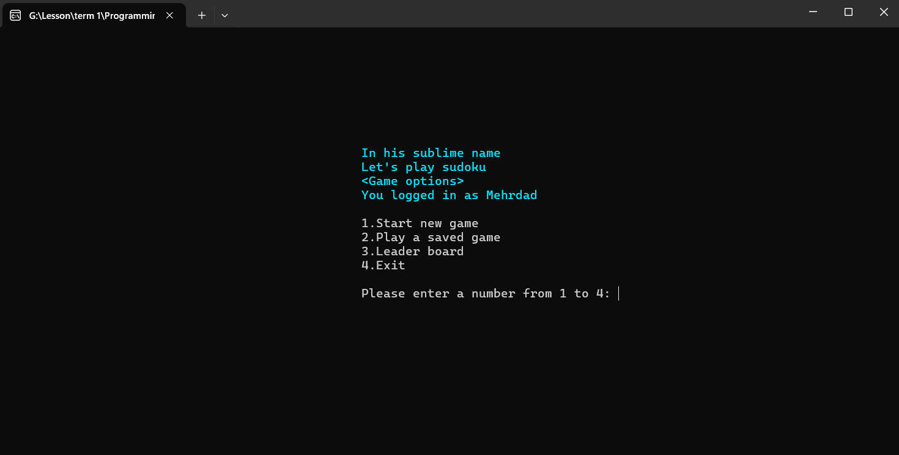
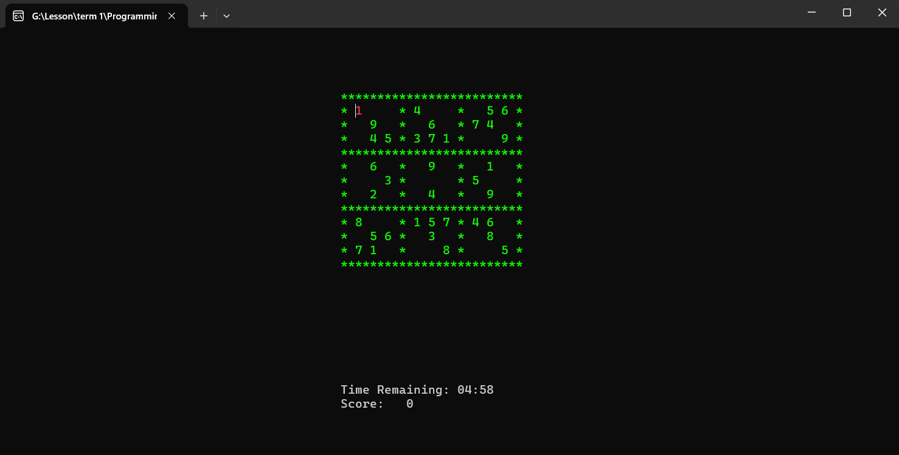
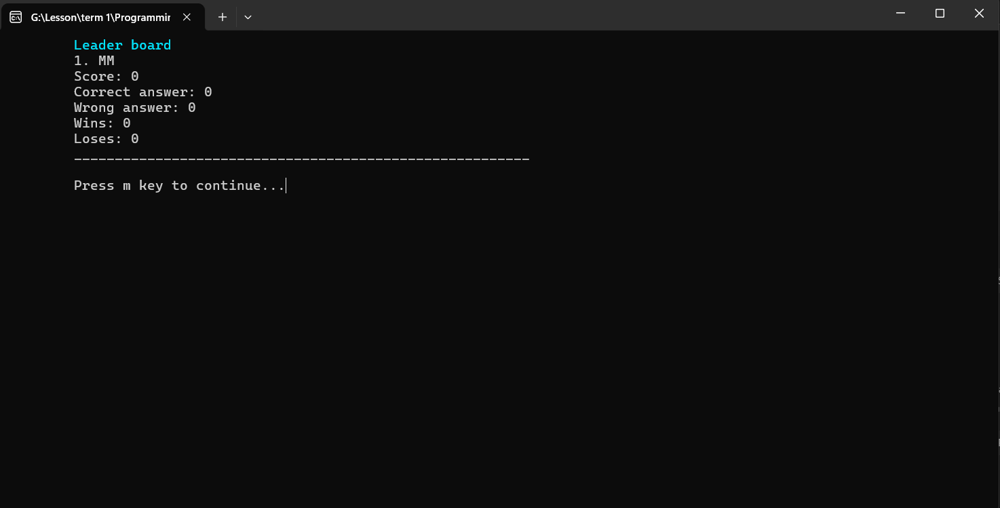

# 🎯 Sudoku Game with C++

👋Hello, I am Mehrdad.  
I am going to share with you one of my university projects for the Basics of Programming course.   
This program is a simple Sudoku game written in C++ and running in the console environment and developed with the clui library.😉

## 🚀 Features
✅ Has three levels: easy, medium and hard  
✅ Has several different tables and the ability to add and edit tables  
✅ Ability to calculate player points and has timers and time limits  
✅ Ability to save user and player information  

## 🔧 How to install and run
You can download this project and enjoy playing with it.
```bash
git clone https://github.com/MehrdadMotahari/sudoku-game-with-CPP.git
cd sudoku-game-with-CPP

g++ sudoku.cpp -o sudoku

./sudoku
```

## 📸 Preview
### Home
  
### Game
  
### Leader board
  

## ✨ Author 
👤 **Mehrdad Motahari**  
📧 Email: [Mehrdad.Mo2005@gmail.com](mailto:mehrdad.mo2005@gmail.com)  
🔗 GitHub: [github.com/MehrdadMotahari](https://github.com/MehrdadMotahari)  

